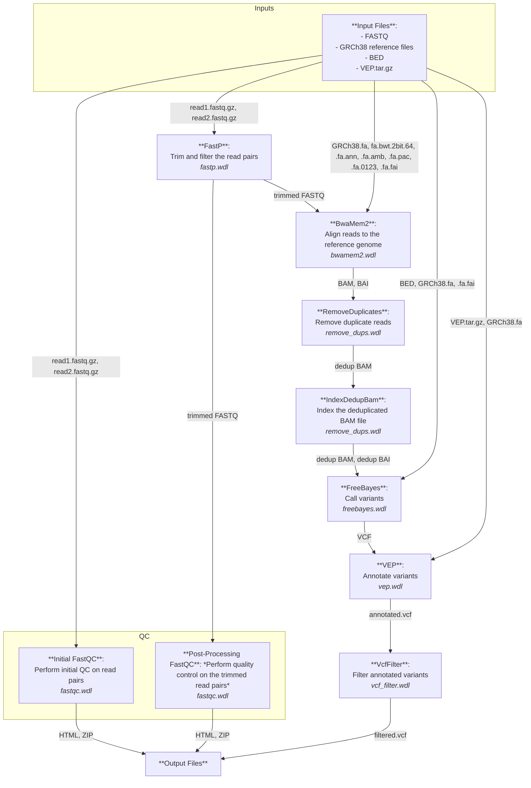

# software_mini_project for software training module

## Overview
This repository contains a modular WDL workflow (`my_pipeline_modular_wf.wdl`) designed to process constitutional, genomic data. The workflow includes quality control, read trimming, alignment, duplicate removal, variant calling, annotation, and VCF filtering.

The final output of the workflow is a filtered VCF file that contains variant calls annotated by the Variant Effect Predictor (Ensembl VEP). The filtering criteria are based on the following conditions:

- Variants with GnomAD allele frequencies < 0.05 that are **NOT** marked as '*benign*' in ClinVar.
- Variants with GnomAD allele frequencies > 0.05 that **ARE** marked as '*pathogenic*' in ClinVar.

The filtering process is implemented using a Python script that parses the CSQ field of the VCF file, extracts relevant annotations, and applies the defined filters.

### Pipeline Flowchart
Here is a visual representation of the `my_pipeline_modular_wf.wdl` workflow using a mermaid flowchart:


## Installation
To set up the workflow, follow these steps:

1. Clone the repository:
```
git clone https://github.com/RobM687/software_mini_project.git
cd software_mini_project
```

2. Set up and acitvate the Python virual environment:
```
python3 -m venv venv
source venv/bin/activate
 ```

3. Install dependencies: Install the required Python packages using `requirements.txt`
```
pip install -r requirements.txt
 ```

4. Ensure packages have installed
```
pip show <package>
```

5. Run the workflow: Use `miniwdl` to run the WDL workflow. Replace `config/my_pipeline_modular_inputs.json` with your input JSON file.
```
miniwdl run scripts/my_pipeline_modular_wf.wdl -i config/test_inputs.json
```

## Inputs
- **read1**: First read file in FASTQ format. *(Used in fastqc, fastp, bwamem2)*
- **read2**: Second read file in FASTQ format. *(Used in fastqc, fastp, bwamem2)*
- **reference_fa**: Reference genome in FASTA format. *(Used in bwamem2)*
- **reference_fabwt2bit64**: BWT 2-bit 64 file for the reference genome. *(Used in bwamem2)*
- **reference_faann**: ANN file for the reference genome. *(Used in bwamem2)*
- **reference_faamb**: AMB file for the reference genome. *(Used in bwamem2)*
- **reference_fapac**: PAC file for the reference genome. *(Used in bwamem2)*
- **reference_fa0123**: 0123 file for the reference genome. *(Used in bwamem2)*
- **reference_fafai**: FAI index file for the reference genome. *(Used in freebayes)*
- **bed_file**: BED file for regions of interest. *(Used in freebayes)*
- **vep_tar**: VEP annotation tool tarball. *(Used in vep)*
- **cache_version**: Cache version for VEP. *(Used in vep)*
- **fork**: Number of forks for VEP. *(Used in vep)*

## Outputs

- **initial_qc_reports**: Initial QC reports in HTML format. *(Generated by fastqc)*
- **initial_qc_summaries**: Initial QC summaries in ZIP format. *(Generated by fastqc)*
- **post_processing_qc_reports**: Post-processing QC reports in HTML format. *(Generated by fastqc)*
- **post_processing_qc_summaries**: Post-processing QC summaries in ZIP format. *(Generated by fastqc)*
- **trimmed_read1**: Trimmed first read file. *(Generated by fastp)*
- **trimmed_read2**: Trimmed second read file. *(Generated by fastp)*
- **alignedBam**: Aligned BAM file. *(Generated by bwamem2)*
- **alignedBai**: Aligned BAI index file. *(Generated by bwamem2)*
- **dedup_bam**: Deduplicated BAM file. *(Generated by remove_dups)*
- **dedup_bai**: Deduplicated BAI index file. *(Generated by remove_dups)*
- **dedup_metrics**: Deduplication metrics file. *(Generated by remove_dups)*
- **vcf**: VCF file with called variants. *(Generated by freebayes)*
- **annotated_vcf**: Annotated VCF file. *(Generated by vep)*
- **filtered_vcf**: Filtered VCF file. *(Generated by vcf_filter)*